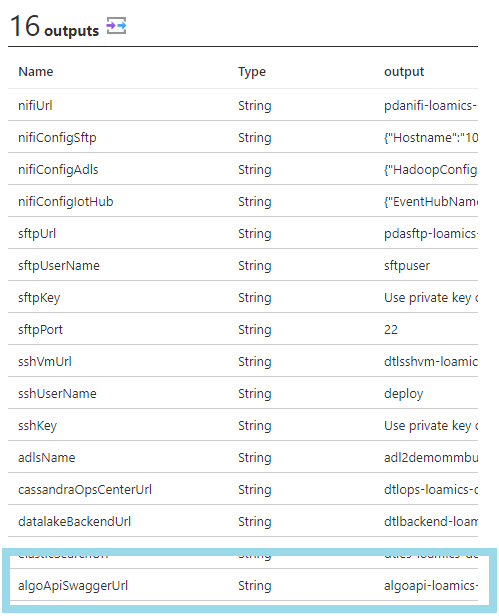
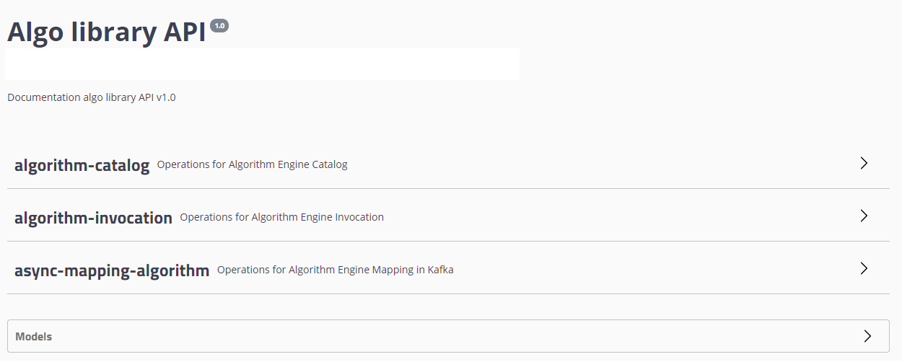
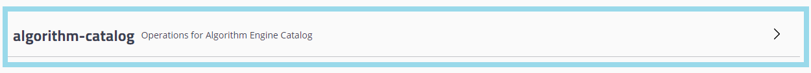

### Algo Catalog

First get the URL in the doployment outputs info of your Azure Managed Application

Don't forget to allow your Personal Public IP thanks to the NSG Rule
Then go to the URL, no need to authenticate

Locate the Catalog

The first function give you the list of Algo declared and available in your Loamics Platform
Easy to execute

The list is printed in JSON Format

