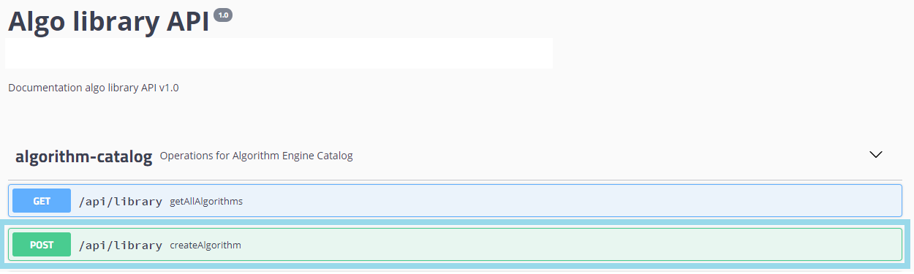
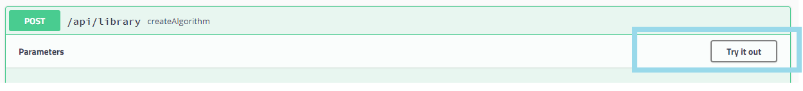

### Algo declaration

On your Swagger Interface, locate and go to **algorithm-catalog** > ***POST /api/library createAlgorithm***



Then **Try it out** to config and execute it



Adapt and complet the params value


Below a sample config text

```json
{
"id_algo": 0,
"business_name": "Loamics Algo Demo for invoices computation",
"technical_name": "LoamicsDemoAlgo",
"input": "{\"definitions\":{},\"$schema\":\"http://json-schema.org/draft-07/schema\",\"$id\":\"http://example.com/example.json\",\"type\":\"object\",\"title\":\"The Root Schema\",\"description\":\"The root schema comprises the entire JSON document.\",\"required\":[\"partner.code\",\"start_date\",\"end_date\",\"group\",],\"properties\":{\"partner.code\":{\"$id\":\"#/properties/body/properties/partner.code\",\"type\":\"string\",\"title\":\"The partner.code Schema\",\"description\":\"An explanation about the purpose of this instance.\",\"default\":\"\",\"examples\":[\"accenture\"]},\"start_date\":{\"$id\":\"#/properties/body/properties/start_date\",\"type\":\"string\",\"title\":\"The start_date Schema\",\"description\":\"An explanation about the purpose of this instance.\",\"default\":\"\",\"examples\":[\"2020-01-01\"]},\"end_date\":{\"$id\":\"#/properties/body/properties/end_date\",\"type\":\"string\",\"title\":\"The end_date Schema\",\"description\":\"An explanation about the purpose of this instance.\",\"default\":\"\",\"examples\":[\"2020-02-28\"]},\"group\":{\"$id\":\"#/properties/body/properties/group\",\"type\":\"string\",\"title\":\"The group Schema\",\"description\":\"An explanation about the purpose of this instance.\",\"default\":\"\",\"examples\":[\"fluid\"]}}}",
"output": "null",
"dataframe_input": "null",
"parameters_input": "",
"category": "analysis",
"fluid": "GENERAL",
"country": "IE",
"technology": "R",
"location": "LoamicsDemoAlgo::loamics_demo",
"description": "Invoices aggregation based on types of fluid or delivery points",
"version": "0.0.0.9",
"start_date": "2021-19-03T14:30:00.000+0000",
"indicator": "{\"effect_of_test\": \"value\", \"important_factor\":\"value\",\"clustering\":\"string\",\"predicted_value\":\"value\"}",
"list_functionalities": "[\"Descriptive Analysis\", \"Data Mining\", \"Forecasting\"]"
}
```
Click **Execute**


And expect a **code 200** withe the new algo info

