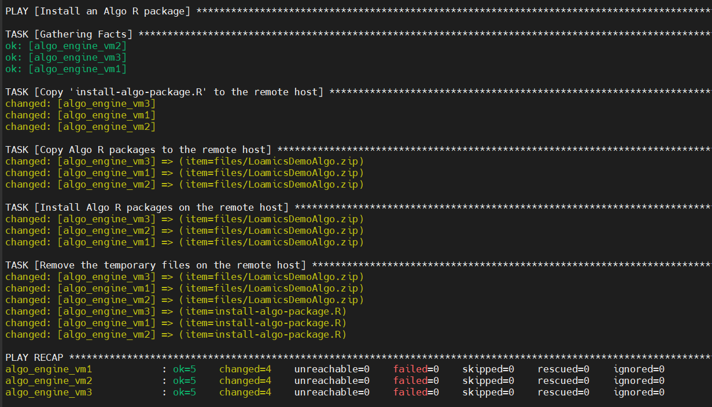

### Algo deployment

After your algo created and available, you'll need to deploy your Algo **R or Python** to the Algo Engine

##### SSH Connect to the platform

Retrieve the SSH informations from deployment outputs info of your Azure Managed Application


An Ansible Script **Algo Deployer** is provided to assist you deploying your Algo(s)

##### Edit script Deployer Config

Just push your script(s) in **zip** format on the Loamics SSH VM, and edit a single config file **hosts.yml**


Then execute it

```bash
ansible-playbook install_algo.yml -i hosts.yml
```

