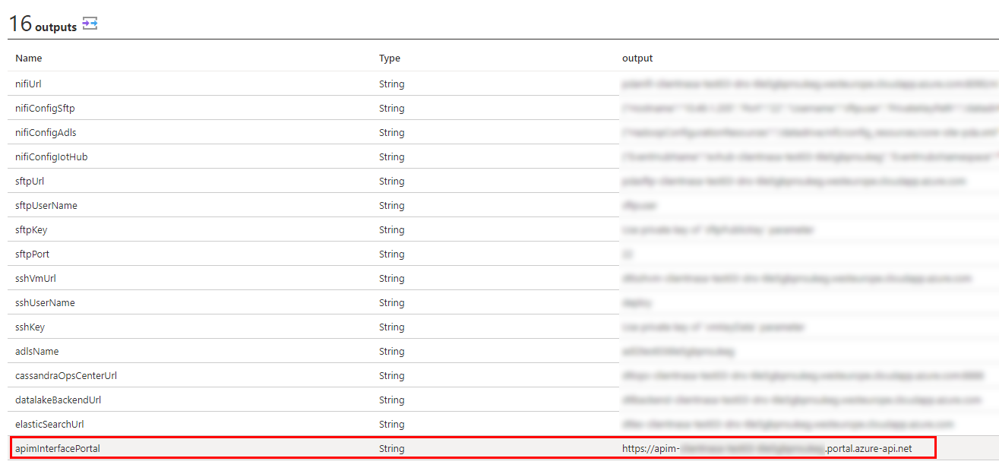
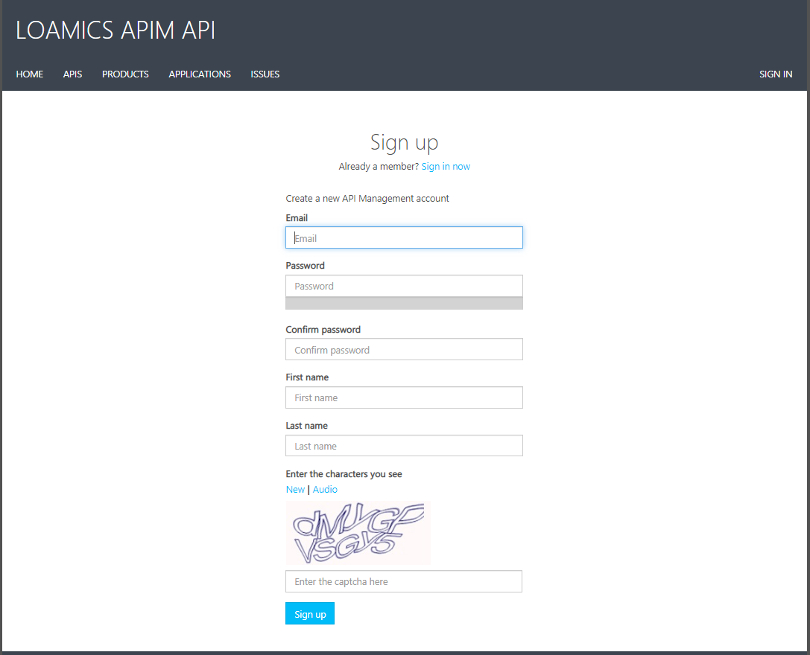
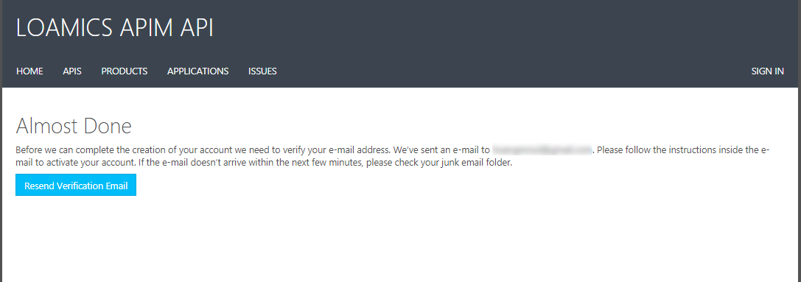
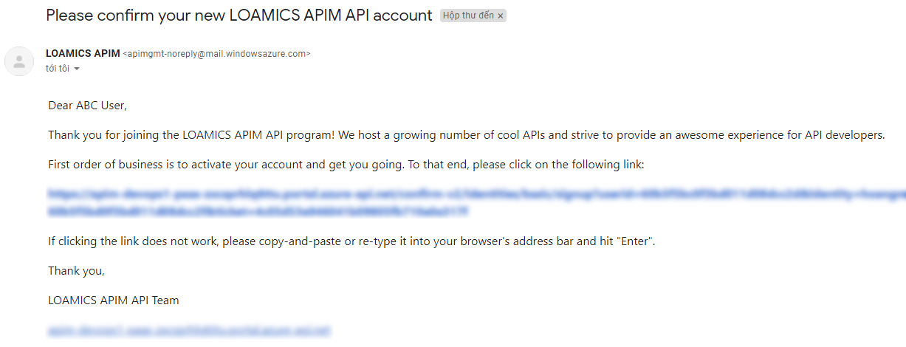
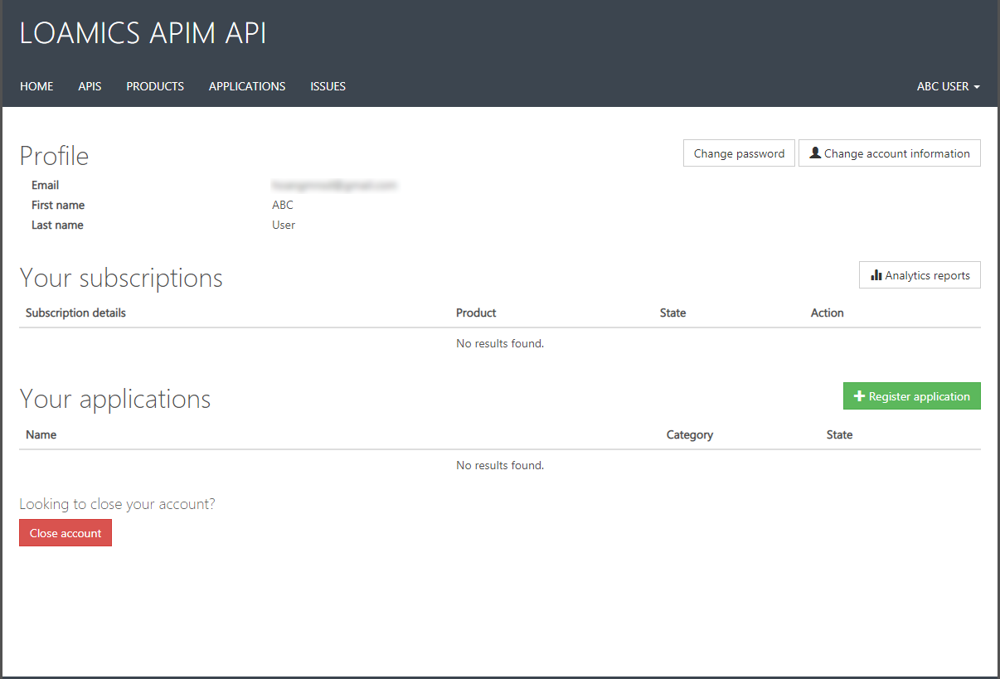
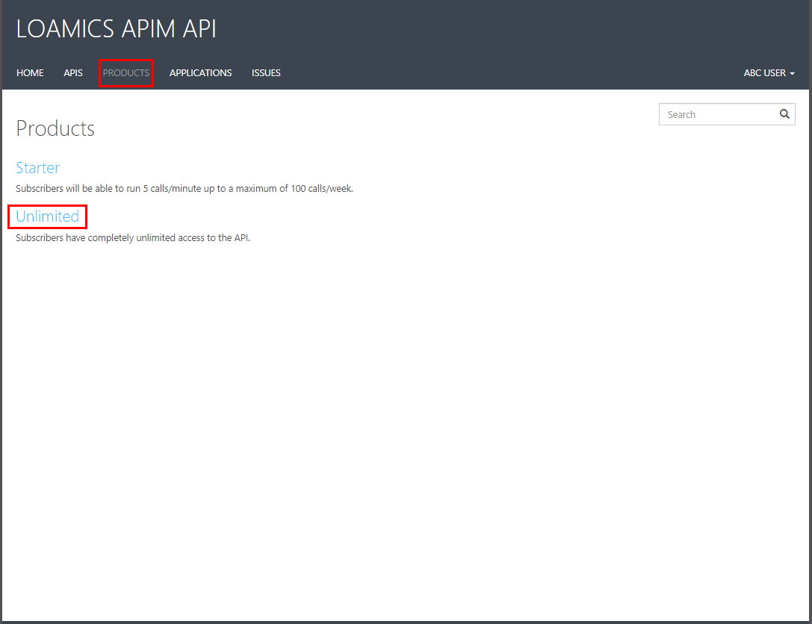
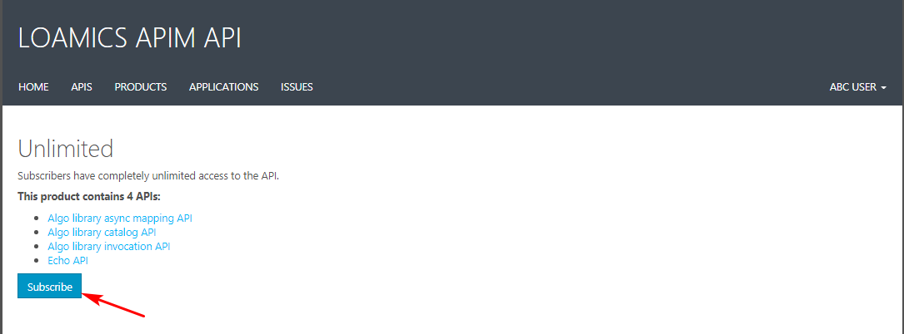
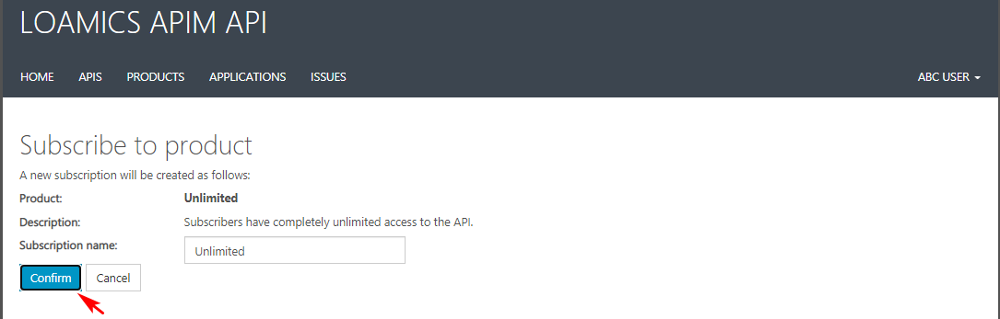
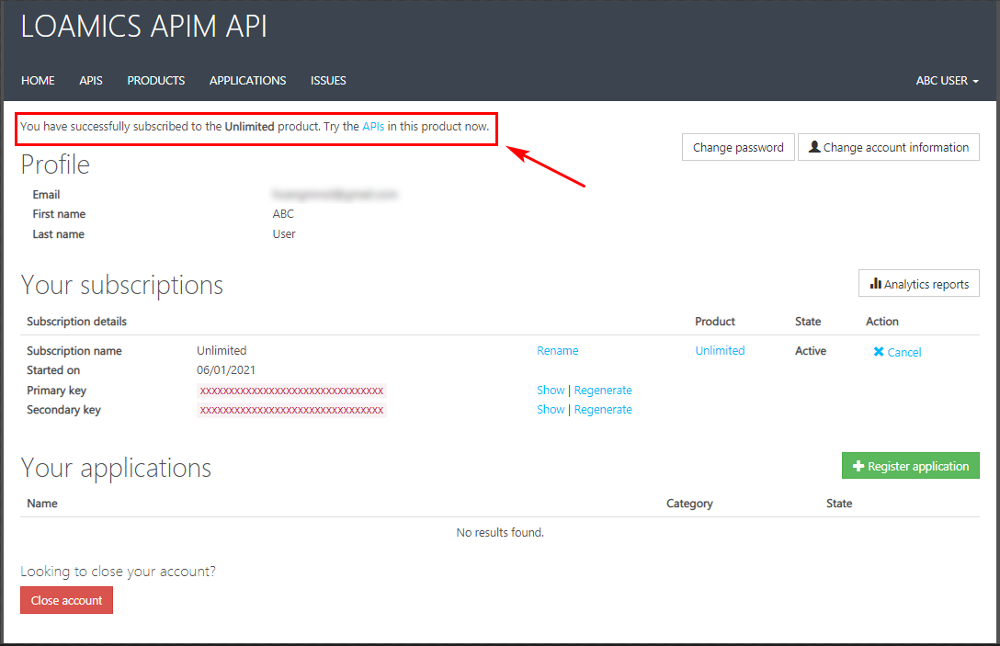
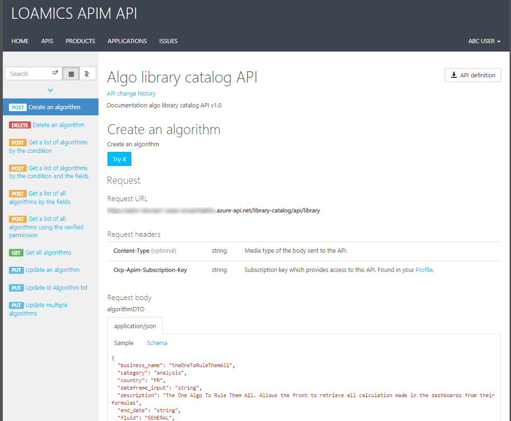

# APIM

###### Version 1.1.3.0

## I. Authenticate

Learn how to authenticate to APIM.

First get the URL in the deployment outputs info of your Azure Managed Application:  
  

This is APIM Portal interface:  

Let click to button `Sign Up` if you are a new user:  
  

Check your email inbox to get verification email:  
  
  
  

When you already Signed in to the Portal, click to `Product` tab -> select `Unlimited`:  
  

Click button `Subscribe`:    
  

Click button `Confirm`:
  
This is successfully confirm screen:  
  

Click to `API` tab to see what API you can try (in red box):  
  

For example, when you select `Algo library catalog API`:  
  

End.

---