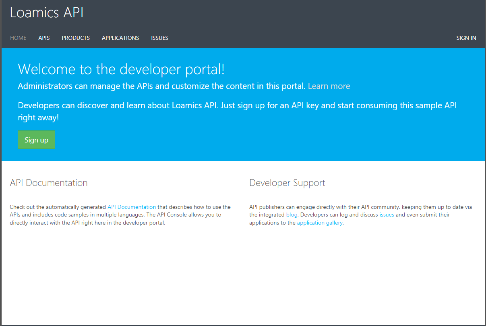

# APIM - API Management

###### Version 1.1.3

## 1. Access to APIM Developer Portal UI

First get the URL in the deployment outputs info of your Azure Managed Application

Don't forget to allow your Personal Public IP thanks to the NSG Rule. 
Then go to the URL, no need to authenticate

Click on `API` tab, then select `Algo Library Catalog API` for example:  

Select `Get all algorithms` and click `Try it`:  

If you see this error, it means you should provide `Ocp-Apim-Subscription-Key` in the Header:  

See the next section to get `Ocp-Apim-Subscription-Key`

## 2. How to get Ocp-Apim-Subscription-Key of APIM

2.1/ Go to [Azure Portal](https://portal.azure.com)

2.2/ Locate and go to your Managed Application

2.3/ Locate and go to the Managed resource group  

2.4/ Filter `apim` and select the `API Management service` resource type  

2.5/ Select `Subscription` tab then try to Copy the primary/secondary key  

  

  

2.6/ Paste the `Ocp-Apim-Subscription-Key` to this field and click `Send` to make the request

  

If everything OK, you will get the Respone 200 status:  
  

---