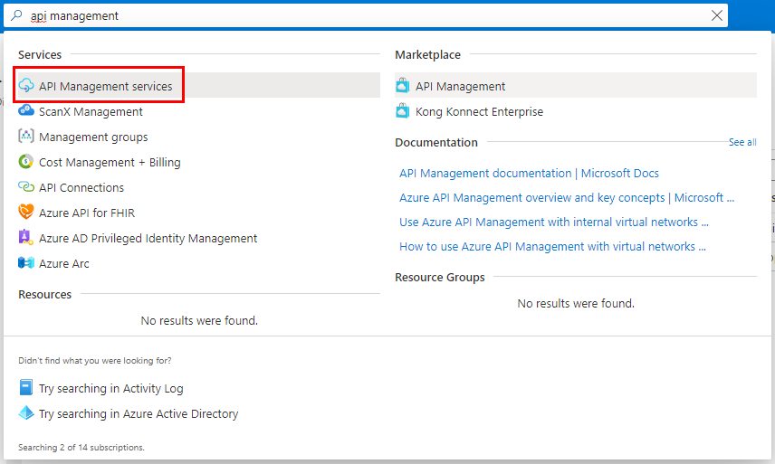
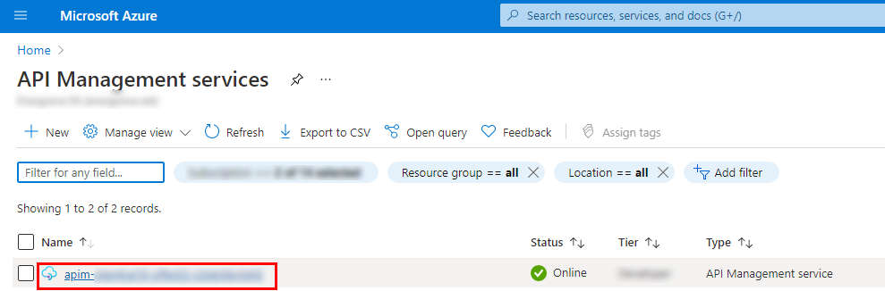
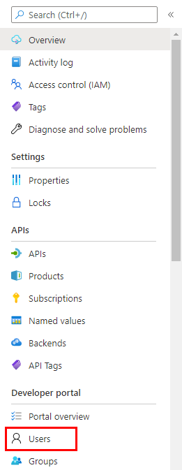
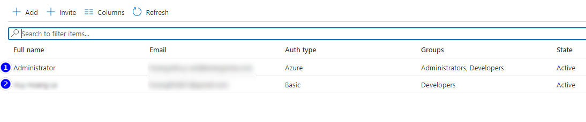
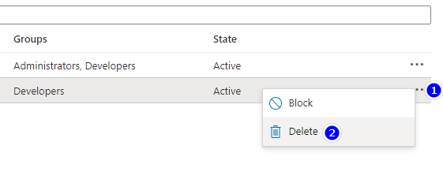
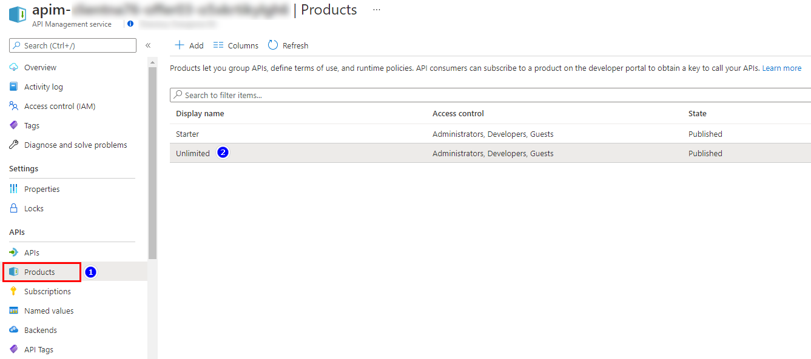
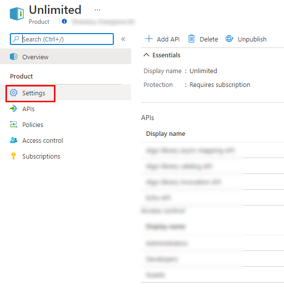
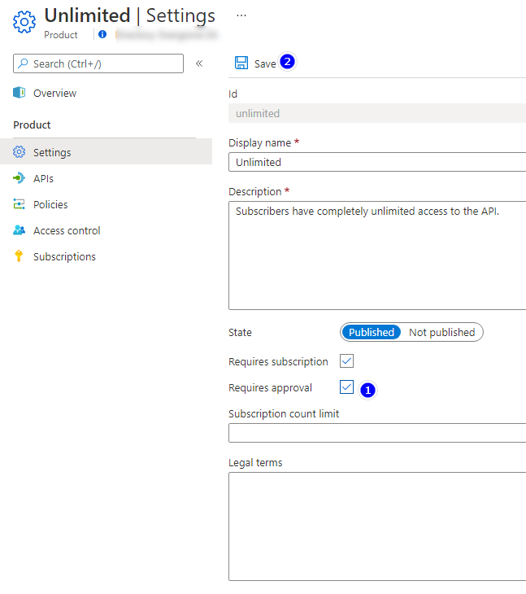
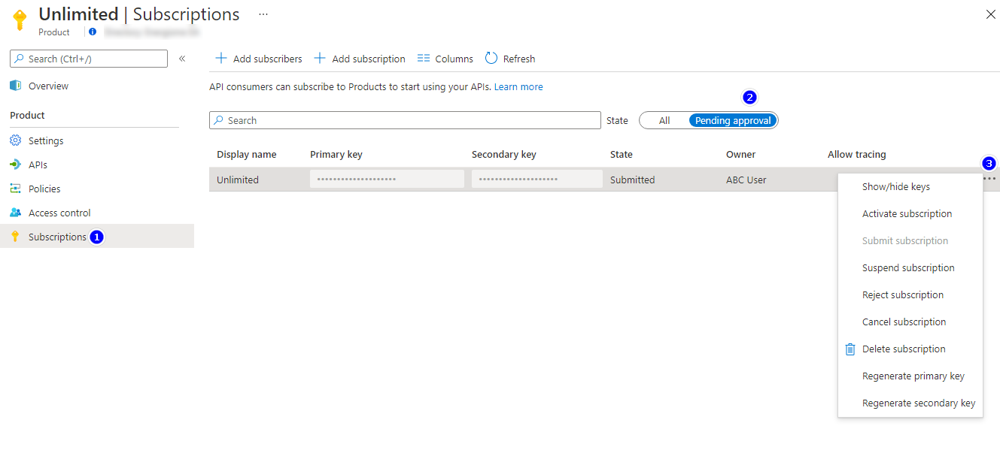

# APIM

###### Version 1.1.3.0

## II. Administration

Learn how to manage users of APIM.

From Azure Portal, search for `API Management Service`:  

Select your Apim service:  

On the left side, select `User` tab:  

Here you can see the User list:  

First line is Administrator user.  
Second line is Basic user that you signed-up by yourself.  

If you realize an unrecognized user, you can delete/block him:  

### If you want each time a user subscribe to `Unlimited` product, he/she must to get approval from Administrator:  
Go to `Product` tab -> `Unlimited`:  

Select `Setting`:  

Check on `Requires approval` then Save:   

Now, when a User request to subscribe `Unlimited` product, you can approve/decline at this screen:  

---