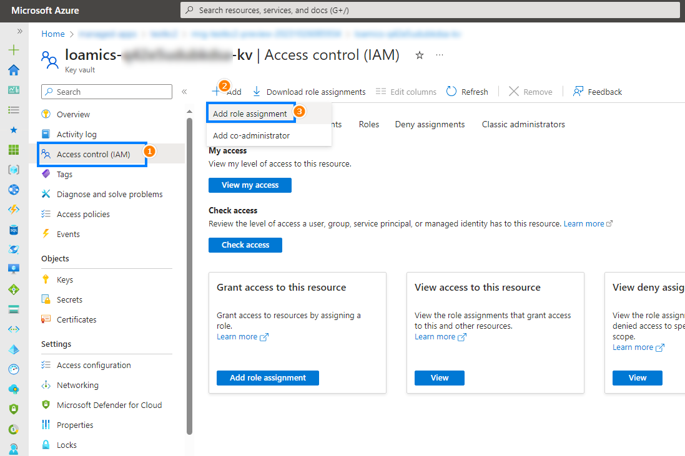

# Get passwords from Azure Keyvault

###### Version 2.4.0

## I. About this document

This page explains how to get password to access some applications.

## II. Steps

Start from this screen, select `Managed resource group`:  

Search for `kv` and then select the Key vault:

Select `Access control IAM -> Add -> Add role assignment`:

Select `Keyvault Secret Officer -> Next`: 

Select `Select members` -> Search for your account name -> Select that displayed account: 

Confirm Selected members -> Next:

Select `Review + assign`:

Confirm that `Added Role assignment`:

Refresh page, Select `Secrets` -> Choose the password you want to see (Ex: `digdash-admin-password`):

Select current version:  

Now you can show the value or copy it to clipboard:  

Please use that value as the password to access applications. 

**Note**:  
- The password stored in Key Vault is the initial password. In the future, if you change the password within the application, the new password **will not** be automatically updated in Azure Key Vault. 

- If you change the value of secret in Azure Key Vault, it **will not** automatically update password in applications. 

---