## DataCollect UI

###### Version 2.4.0

### Access to your DataCollect UI

1/ Go to [Azure Portal](https://portal.azure.com)

2/ Locate and go to your Managed Application

3/ Then go to *Settings* > *Parameters and Outputs*

4/ And get the ** URL

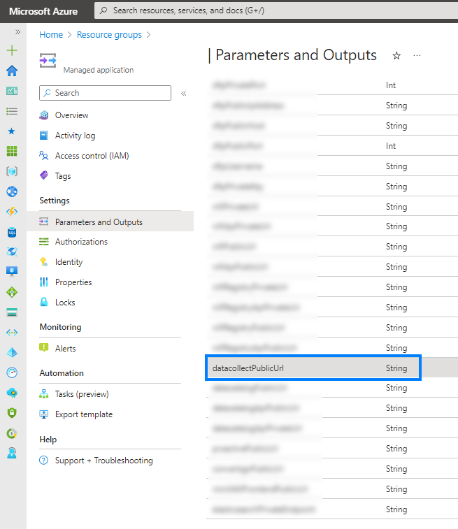

---

You get the login page of DataCollect UI

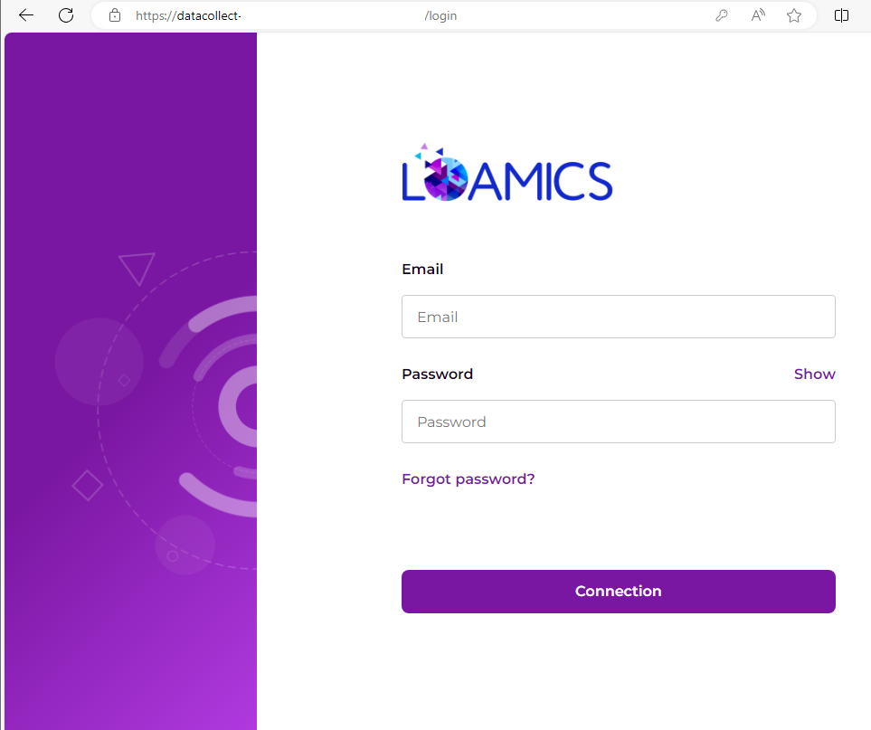

### How to get password of DataCollect UI

Click on `Forgot password?` hyperlink

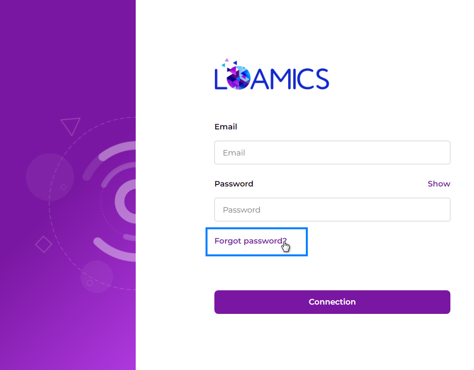

Input your email address here, then click `Reset my password`

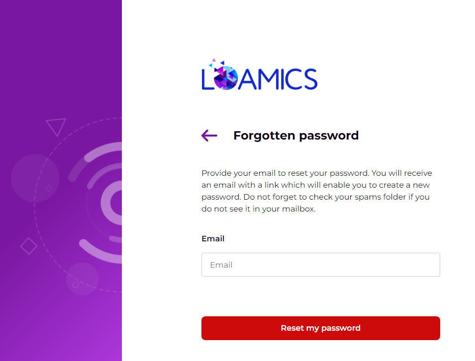

Check your email address screen

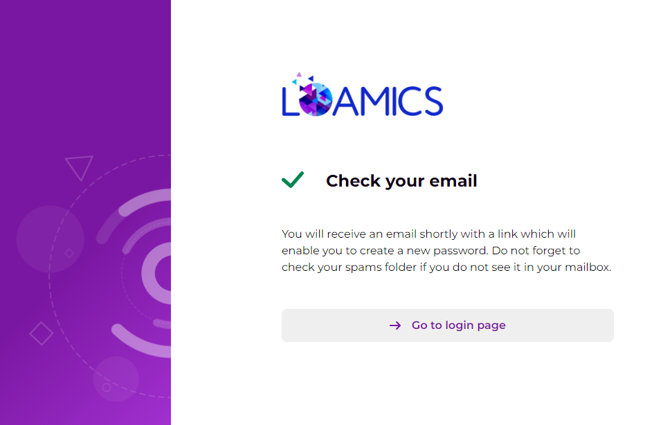

Check your mail box, your will receive an email like this, click on button `Réinitialiser mon mot de passe`

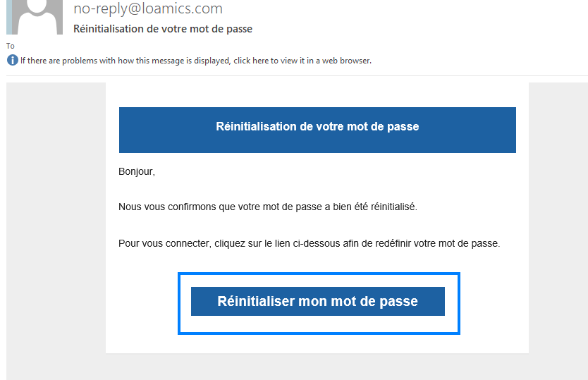

Input your defined password

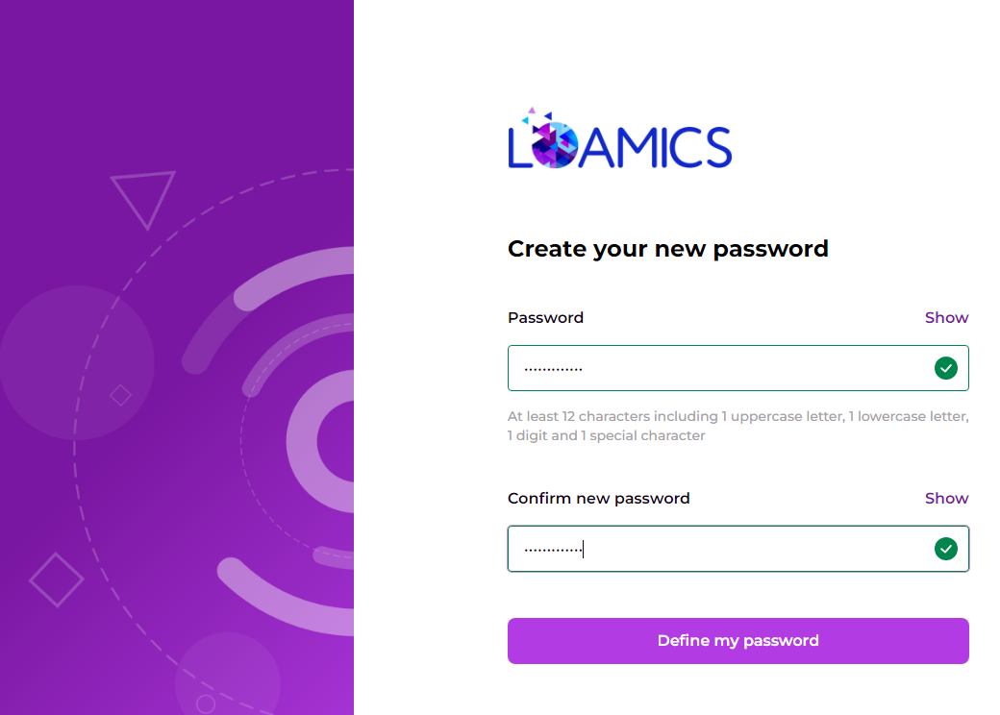

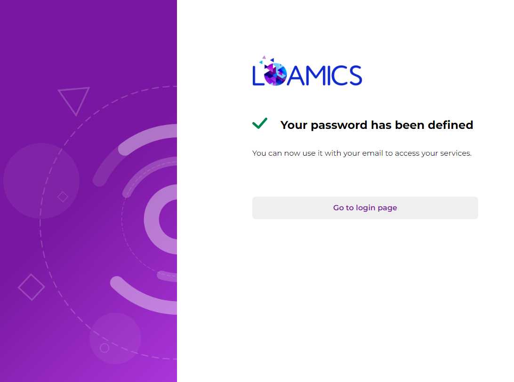

Login with your new password

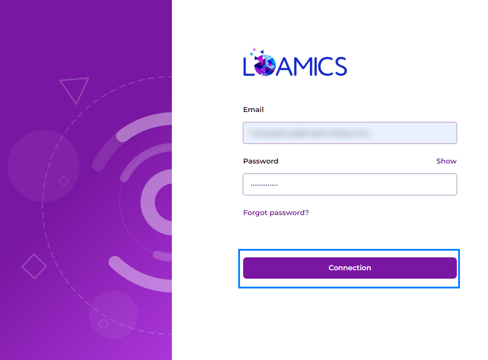

After login success, you will see the Data Flows screen

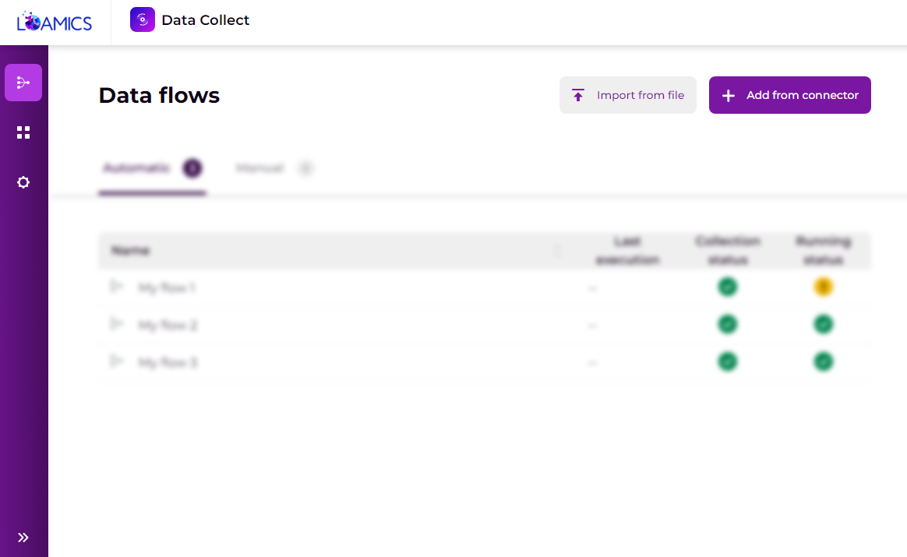

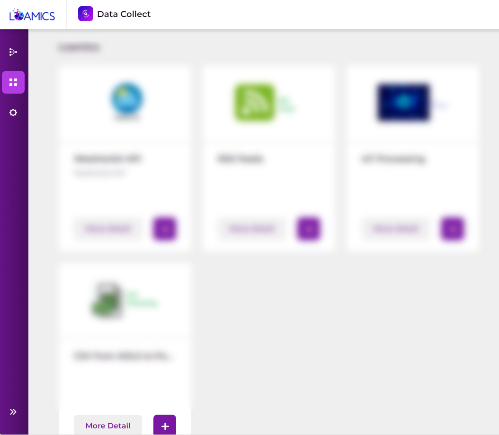

---