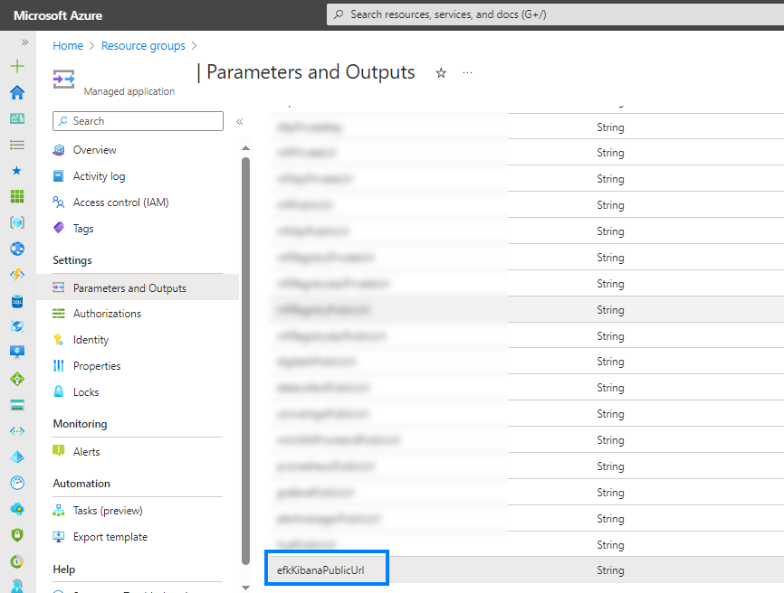

## Kibana

###### Version 2.4.0

### Your window into the Elastic Stack

Kibana is a free and open user interface that lets you visualize your Elasticsearch data and navigate the Elastic Stack. Do anything from tracking query load to understanding the way requests flow through your apps.

### Access to your Kibana interface

1/ Go to [Azure Portal](https://portal.azure.com)

2/ Locate and go to your Managed Application

3/ Then go to *Settings* > *Parameters and Outputs*

4/ And get the *Kibana* URL

---

Here is your Kibana Interface

### Go to Discover

To access main and usefull features

### Index Management

### Dev Tools

