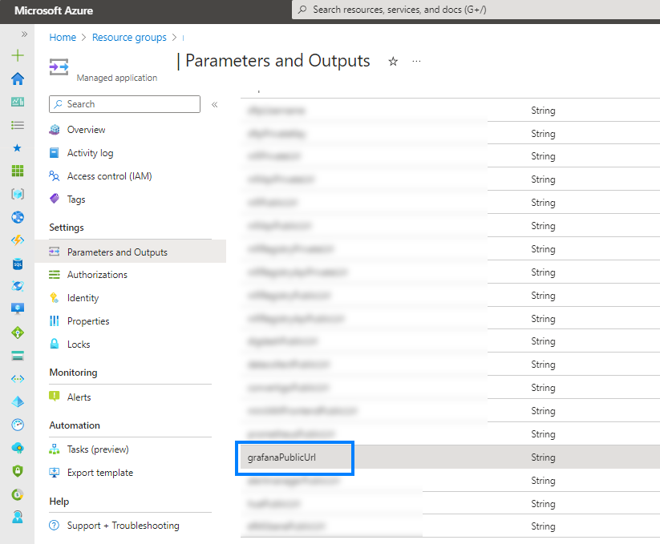
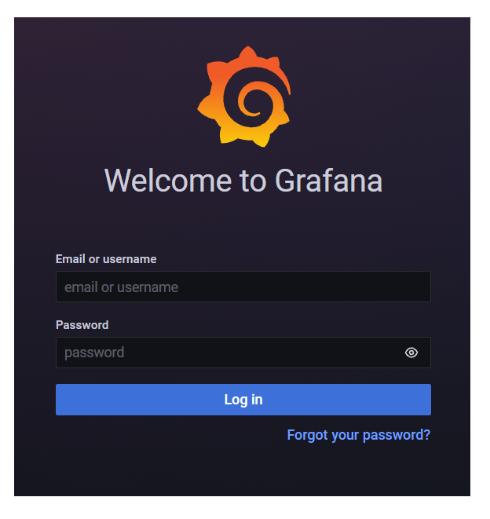
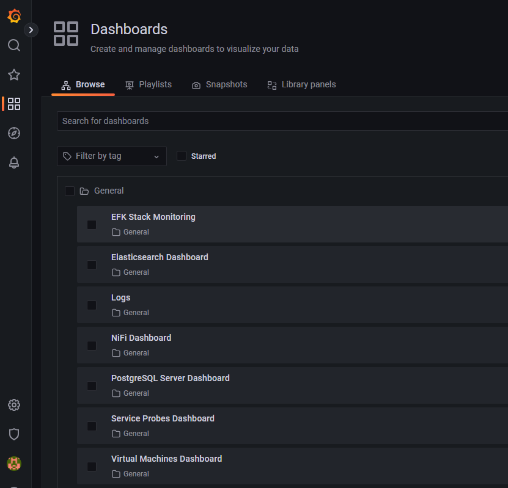

## Grafana

###### Version 2.4.0

### Dashboard anything. Observe everything.
Query, visualize, alert on, and understand your data no matter where it’s stored. With Grafana you can create, explore and share all of your data through beautiful, flexible dashboards.

### Access to your Grafana interface

1/ Go to [Azure Portal](https://portal.azure.com)

2/ Locate and go to your Managed Application

3/ Then go to *Settings* > *Parameters and Outputs*

4/ And get the *Grafana* URL

---

### Authentication

Login username: `admin`.  
Login password: Use tutorial in page [Get passwords from Azure KeyVault](./vi_pages.md) to get `grafana-admin-password`

Here is your Grafana Interface

Access Dashboards to monitor different services:

Explore live datas

