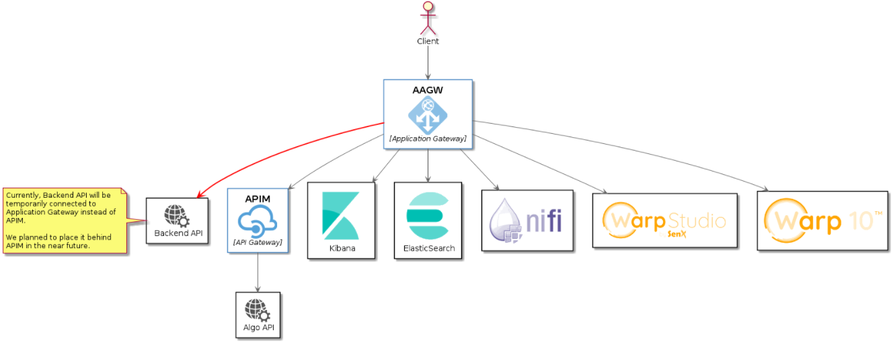

## V. Update IP whitelist 

### Prerequisites

From PaaS version v1.1.3, Azure Application Gateway is applied as the below diagram:  

Since Azure Application Gateway supported only TLS 1.2, client web browser should enable support for TLS 1.2 also.

### In case you want to update IP whitelist for above services

1/ Go to [Azure Portal](https://portal.azure.com)

2/ Locate and go to your Managed Application

3/ Locate and go to the Managed resource group

4/ Filter `appgw` and select the Network Security Group resource type:  

5/ Select `Inbound security rules` then you can update IP in the `Allow_Whitelist` rule

When the rule is updated, you can test the connection.  

If you have issues when updating the rule, maybe you don't have enough permission, you should contact Publisher for support.  

### In case you want to update IP whitelist for SFTP server and SSH server

Azure Application doesn't apply for SSH and SFTP server. They manage whitelist IP in the separate Network security group (NSG)

1/ Go to [Azure Portal](https://portal.azure.com)

2/ Locate and go to your Managed Application

3/ Locate and go to the Managed resource group

4/ Filter `sftp` and select the Network Security Group resource type:  

5/ Select `Inbound security rules` then you can update IP in the `Allow_Whitelist` rule

When the rule is updated, you can test the connection.

You can filter `ssh` to do the same way with SSH server's Network security group.
