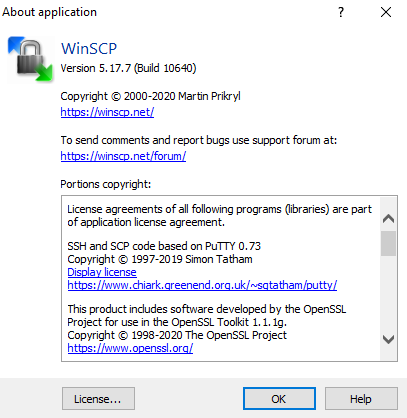
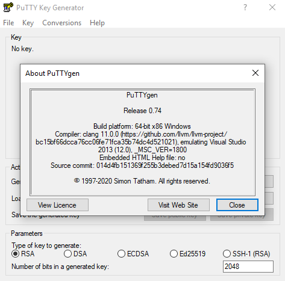
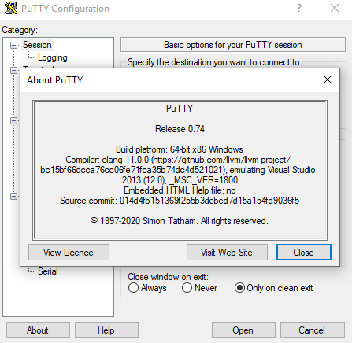

## II. Prerequisites

##### 1. Windows

##### 2. WinSCP – Here is the version we use for this tutorial

##### 3. PuttyGen – Here is the version we use for this tutorial

Once you install the PuTTY on your machine, you can easily run PuTTYgen.   
  
  

##### 3. SFTP private key - the key you will use to authenticate the SFTP server

  
this is the key that you generated in Step 2 of [Deployment-User-Manual]  

##### 4. You’ll need to know the Azure Endpoint of the SFTP server

For example, value of `sftpUrl`, `sftpUserName`, `sftpKey`, `sftpPort` in below image:  

---

[Deployment-User-Manual]: https://loamics.github.io/docs/user_manual/ii_pages.html