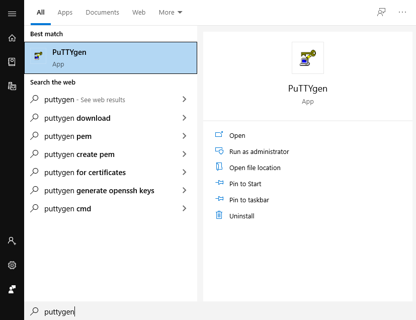
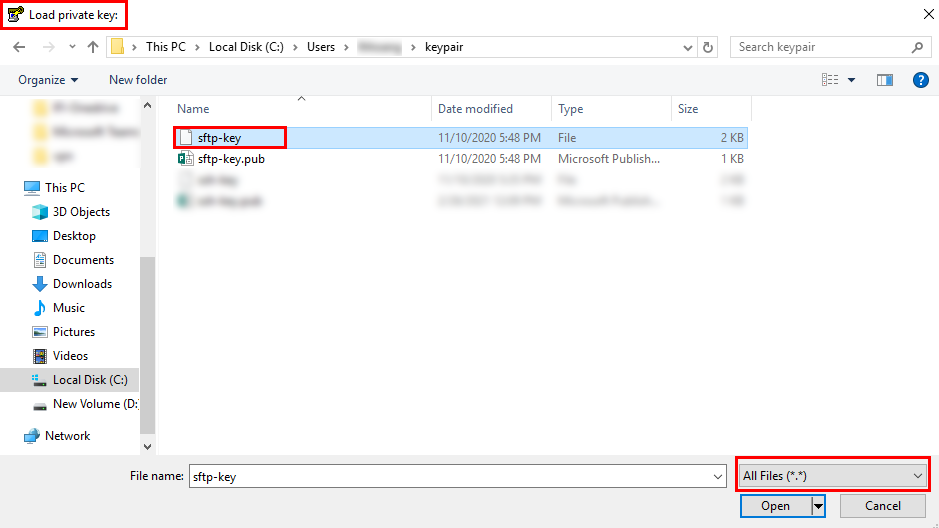
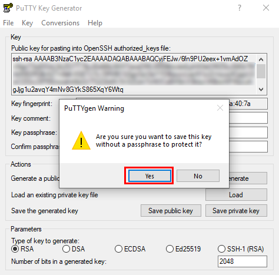
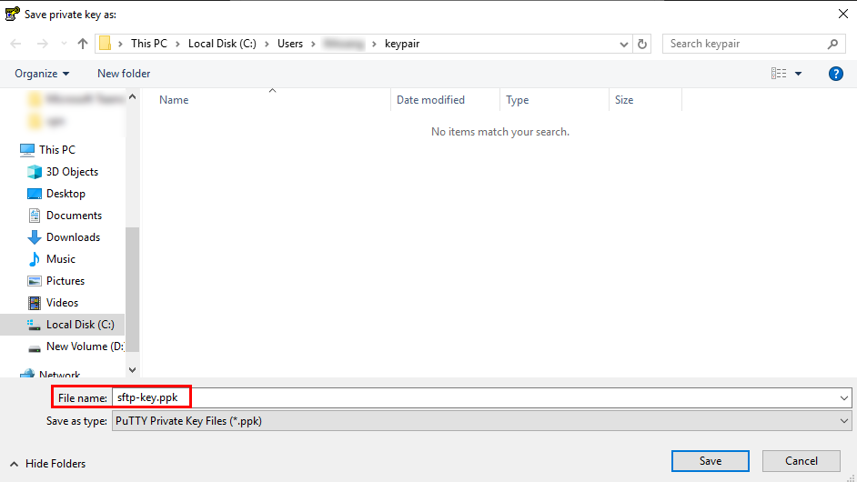

## IV. Convert SFTP Private Key to .PPK file

Once you install the PuTTY on your machine, you can easily run PuTTYgen. 

For the same, go to Windows -> Start Menu -> All Programs -> PuTTY -> PuTTYgen.  

Select "LOAD":  

Select your SFTP Private key:  

Putty will convert your key to .PPK format, select OK:  

Select "Save Private Key":  

Select Yes:  

Save your key with extension .PPK:    

Now, you already have SFTP key with exxtension .PPK in your machine:   

---