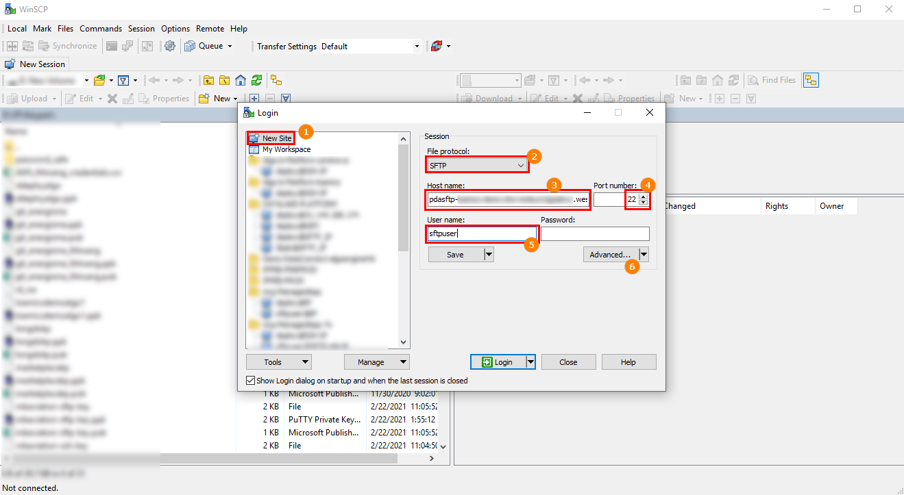
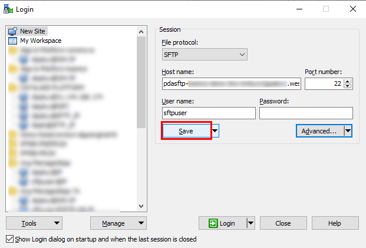
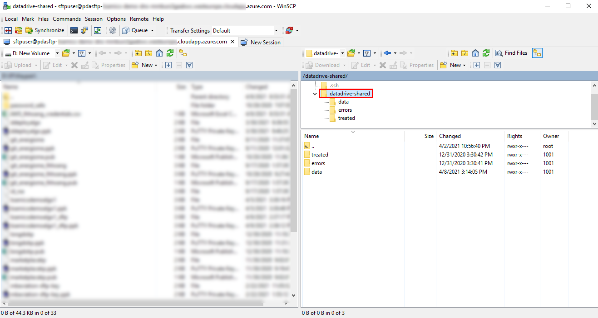

## V. Connect your local machine to SFTP server

In this tutorial, you'll learn how to connect and use SFTP server hosted on Azure Cloud.

### Using WinSCP
Windows -> Start Menu -> All Programs -> WinSCP:  

Create New Site:
① Select New Site.  
② Select SFTP protocol.  
③ Paste the SFTP Enpoint (`sftpUrl`)  
④ Select Port: 22  
⑤ Input User name: `sftpuser`   
⑥ Select Advanced...   

Authenticate:  
① Select Authentication
② Click "..." to select .PPK file

Click "Save":  

Click "Login" to authenticate SFTP:  

Click "Yes" to authenticate SFTP:  

This is screen when you authenticate successfully,  
you have all permission on folder `datadrive-shared`:  

### Using FileZilla

Create New Site:
① Select New Site.  
② Select General tab.  
③ Select SFTP protocol.  
④ Paste the SFTP Enpoint (`sftpUrl`)  
⑤ Select Port: 22  
⑥ Select Logon type: Key file  
⑦ Input User name: `sftpuser`   
⑧ Select Browse to choose .PPK file...  

If evrything ok, you will access to SFTP Server
---