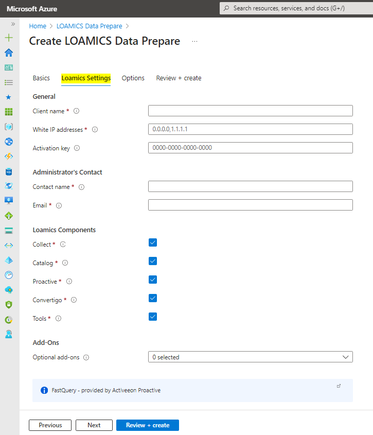
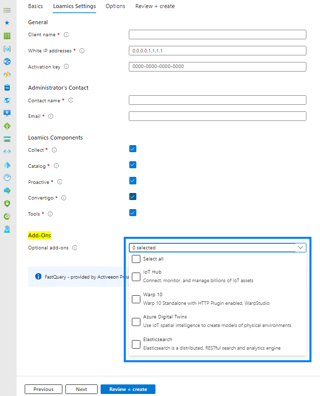
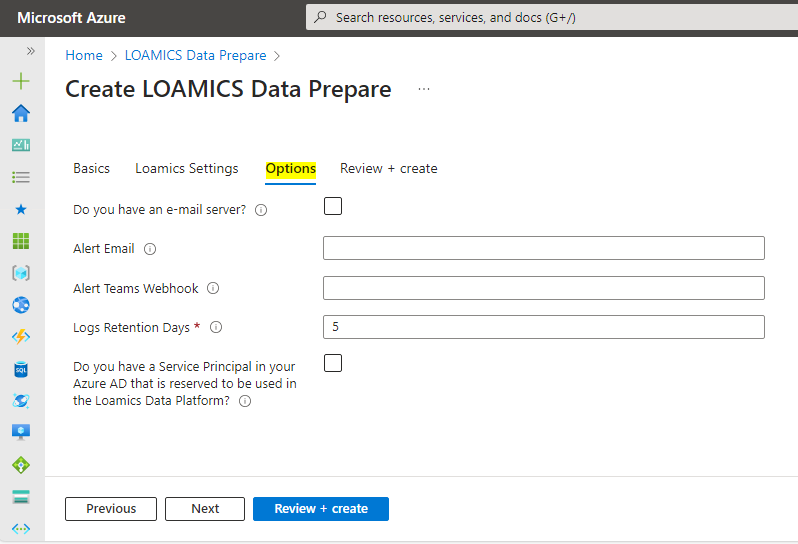
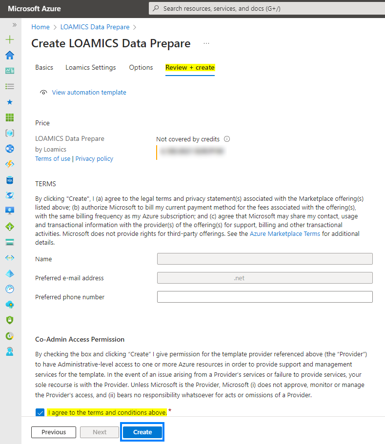

## II. Steps

###### Version 2.4.0

### 1. Basics

Region `West Europe or France Central` are recommended:  
  

### 2. Loamics Settings

 

**General**:

- `Client name`: This is your company/organization in short. The value must be a string of 04-10 lower-case alphanumeric characters. It should not include some worlds that reserved by Microsoft (https://docs.microsoft.com/en-us/azure/azure-resource-manager/templates/error-reserved-resource-name)

- `White IP addresses`: The list of 1~15 IP addresses allowed to access the product. They must be separated by commas. You can see what is your Ip by browsing this site: https://www.myip.com/

- `Activation key`: The product activation key. It is a string of maximum 40 alphanumeric characters. If you have no activation key, please leave this field blank.

**Administrator's Contact**:

- `Contact name`: The administrator name. Please input your name who is getting this product.

- `Email`: The administrator's email address. This email address to receive password of DataCollect and system notifications in the future.

**Loamics Components**: 

- This section is mandatory. No need to unselect them.

**Add-Ons**:

- You can select to install optional add-ons if you want.
    

  Currently, Loamics (version 2.4.0) is providing these addons:  
  + [IoT Hub - Connect, monitor, and manage billions of IoT assets](https://azure.microsoft.com/en-us/products/iot-hub/).  
  + [Warp 10 - The Most Advanced Time Series Platform](https://www.warp10.io/).  
  + [Azure Digital Twins - Use IoT spatial intelligence to create models of physical environments](https://azure.microsoft.com/en-us/products/digital-twins/).  
  + [Elasticsearch - The distributed, RESTful search and analytics engine](https://www.elastic.co/elasticsearch/).  

### 3. Options

  

- `Do you have an e-mail server?`: The Loamics Data Platform will use its e-mail system to send you notifications. Please select this option if you want to use your own e-mail system instead.

- `Alert Email`: The custom email will receive alerts/notifications. By default, the alerts/notifications will be sent to the administrator's email.

- `Alert Teams Webhook`: The Incoming Webhook URL of MS Teams Channel that will receive alerts/notifications.

- `Logs Retention Days`: How many days the service logs should be retained? Default: 5. 

- `Do you have a Service Principal in your Azure AD that is reserved to be used in the Loamics Data Platform?`: To use some features such as Cloudera Hue's ADLS Gen2 connector, please create a new app registration, then input its Client ID and Client Secret here.

### 4. Review and create

Check to agree terms and conditions -> `Create`:  
  

---