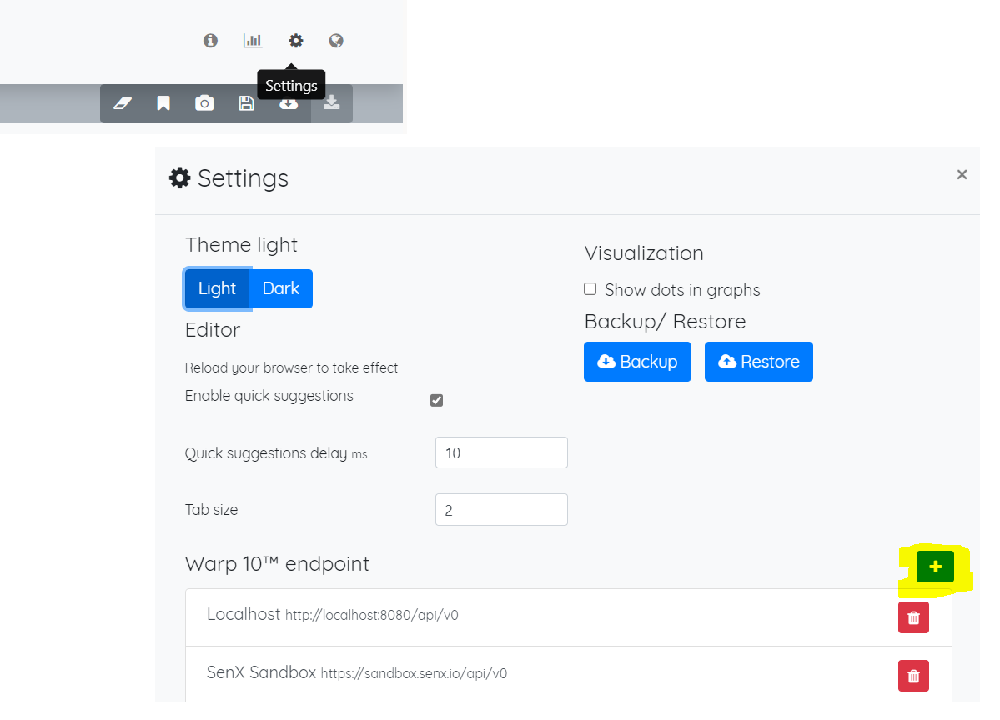

## II. Go to the Warp10 Studio

Access to the Web Warp10 Studio

[http://WARP10_AZURE_ENDPOINT:8081/#/editor/](http://WARP10_AZURE_ENDPOINT:8081/#/editor/)

On the first connection, you need to configure the Warp 10 Backend Endpoint

Precise and adapt the backend endpoint to this format

