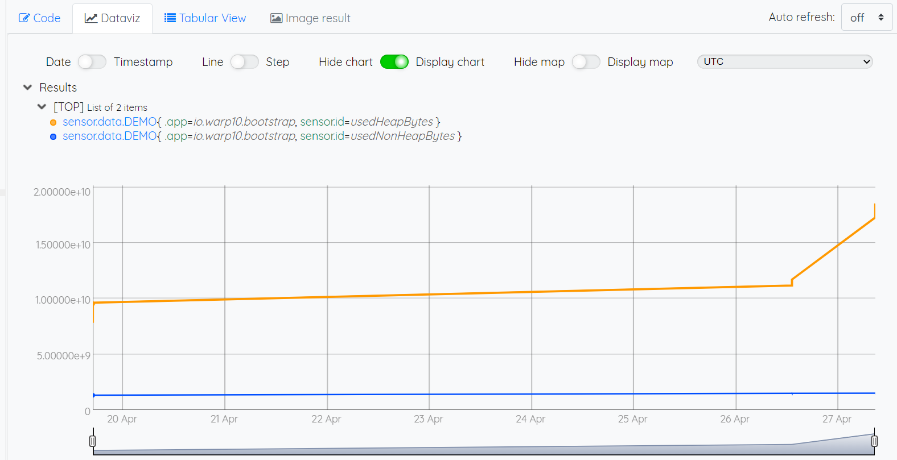

## III. Visualize datas

Always in the Web Warp10 Studio, go to *Code* and select the Warp10 Backend Endpoint


Then add and adapt the code below, with the correct token and channel

```
[ 'WARP10_READTOKEN' 
'sensor.data.DEMO'   <<< datas channel
{} NOW NOW ] 
FETCH 'gts' STORE $gts
```

Execute


Then go to *Dataviz* and visualize datas

