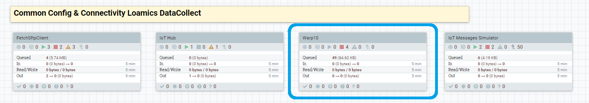

# Connector : Warp10

###### Version 1.1.1.0

## I. About this document

This document explains how to push data from PDA to Warp10 instance using the Loamics Collector Orchestrator

---

Loamics DataCollect Platform provides you a Warp10 connector into a Data Flow sample that retrieve data from the Collector Orchestrator Cluster System Infos from an API, convert datas into Warp10 frames and push them to the Loamics Warp10 Instance.
You can find it into the Loamics Orchestrator Interface

